```mermaid
flowchart TB
    subgraph current["SportsStore.Tests.csproj"]
        MAIN["<b>📦&nbsp;SportsStore.Tests.csproj</b><br/><small>net8.0</small>"]
        click MAIN "#sportsstoretestssportsstoretestscsproj"
    end
    subgraph downstream["Dependencies (1"]
        P1["<b>📦&nbsp;SportsStore.csproj</b><br/><small>net8.0</small>"]
        click P1 "#sportsstoresportsstorecsproj"
    end
    MAIN --> P1

```

```mermaid
flowchart TB
    subgraph upstream["Dependants (1)"]
        P2["<b>📦&nbsp;SportsStore.Tests.csproj</b><br/><small>net8.0</small>"]
        click P2 "#sportsstoretestssportsstoretestscsproj"
    end
    subgraph current["SportsStore.csproj"]
        MAIN["<b>📦&nbsp;SportsStore.csproj</b><br/><small>net8.0</small>"]
        click MAIN "#sportsstoresportsstorecsproj"
    end
    P2 --> MAIN

```

# Projects and dependencies analysis

This document provides a comprehensive overview of the projects and their dependencies in the context of upgrading to .NETCoreApp,Version=v10.0.

## Table of Contents

- [Executive Summary](#executive-Summary)
  - [Highlevel Metrics](#highlevel-metrics)
  - [Projects Compatibility](#projects-compatibility)
  - [Package Compatibility](#package-compatibility)
  - [API Compatibility](#api-compatibility)
- [Aggregate NuGet packages details](#aggregate-nuget-packages-details)
- [Top API Migration Challenges](#top-api-migration-challenges)
  - [Technologies and Features](#technologies-and-features)
  - [Most Frequent API Issues](#most-frequent-api-issues)
- [Projects Relationship Graph](#projects-relationship-graph)
- [Project Details](#project-details)

  - [SportsStore.Tests\SportsStore.Tests.csproj](#sportsstoretestssportsstoretestscsproj)
  - [SportsStore\SportsStore.csproj](#sportsstoresportsstorecsproj)

## Executive Summary

### Highlevel Metrics

| Metric | Count | Status |
| :--- | :---: | :--- |
| Total Projects | 2 | All require upgrade |
| Total NuGet Packages | 13 | 3 need upgrade |
| Total Code Files | 62 |  |
| Total Code Files with Incidents | 3 |  |
| Total Lines of Code | 3049 |  |
| Total Number of Issues | 8 |  |
| Estimated LOC to modify | 3+ | at least 0.1% of codebase |

### Projects Compatibility

| Project | Target Framework | Difficulty | Package Issues | API Issues | Est. LOC Impact | Description |
| :--- | :---: | :---: | :---: | :---: | :---: | :--- |
| [SportsStore.Tests\SportsStore.Tests.csproj](#sportsstoretestssportsstoretestscsproj) | net8.0 | 🟢 Low | 0 | 0 |  | DotNetCoreApp, Sdk Style = True |
| [SportsStore\SportsStore.csproj](#sportsstoresportsstorecsproj) | net8.0 | 🟢 Low | 3 | 3 | 3+ | AspNetCore, Sdk Style = True |

### Package Compatibility

| Status | Count | Percentage |
| :--- | :---: | :---: |
| ✅ Compatible | 10 | 76.9% |
| ⚠️ Incompatible | 0 | 0.0% |
| 🔄 Upgrade Recommended | 3 | 23.1% |
| ***Total NuGet Packages*** | ***13*** | ***100%*** |

### API Compatibility

| Category | Count | Impact |
| :--- | :---: | :--- |
| 🔴 Binary Incompatible | 0 | High - Require code changes |
| 🟡 Source Incompatible | 2 | Medium - Needs re-compilation and potential conflicting API error fixing |
| 🔵 Behavioral change | 1 | Low - Behavioral changes that may require testing at runtime |
| ✅ Compatible | 7741 |  |
| ***Total APIs Analyzed*** | ***7744*** |  |

## Aggregate NuGet packages details

| Package | Current Version | Suggested Version | Projects | Description |
| :--- | :---: | :---: | :--- | :--- |
| coverlet.collector | 3.1.0 |  | [SportsStore.Tests.csproj](#sportsstoretestssportsstoretestscsproj) | ✅Compatible |
| Microsoft.AspNetCore.Identity.EntityFrameworkCore | 8.0.0 | 10.0.3 | [SportsStore.csproj](#sportsstoresportsstorecsproj) | NuGet package upgrade is recommended |
| Microsoft.EntityFrameworkCore.Design | 8.0.0 | 10.0.3 | [SportsStore.csproj](#sportsstoresportsstorecsproj) | NuGet package upgrade is recommended |
| Microsoft.EntityFrameworkCore.SqlServer | 8.0.0 | 10.0.3 | [SportsStore.csproj](#sportsstoresportsstorecsproj) | NuGet package upgrade is recommended |
| Microsoft.NET.Test.Sdk | 16.11.0 |  | [SportsStore.Tests.csproj](#sportsstoretestssportsstoretestscsproj) | ✅Compatible |
| Moq | 4.16.1 |  | [SportsStore.Tests.csproj](#sportsstoretestssportsstoretestscsproj) | ✅Compatible |
| Serilog | 4.3.1 |  | [SportsStore.csproj](#sportsstoresportsstorecsproj) [SportsStore.Tests.csproj](#sportsstoretestssportsstoretestscsproj) | ✅Compatible |
| Serilog.AspNetCore | 10.0.0 |  | [SportsStore.csproj](#sportsstoresportsstorecsproj) [SportsStore.Tests.csproj](#sportsstoretestssportsstoretestscsproj) | ✅Compatible |
| Serilog.Sinks.Console | 6.1.1 |  | [SportsStore.csproj](#sportsstoresportsstorecsproj) [SportsStore.Tests.csproj](#sportsstoretestssportsstoretestscsproj) | ✅Compatible |
| Serilog.Sinks.File | 7.0.0 |  | [SportsStore.csproj](#sportsstoresportsstorecsproj) [SportsStore.Tests.csproj](#sportsstoretestssportsstoretestscsproj) | ✅Compatible |
| Serilog.Sinks.Seq | 9.0.0 |  | [SportsStore.csproj](#sportsstoresportsstorecsproj) [SportsStore.Tests.csproj](#sportsstoretestssportsstoretestscsproj) | ✅Compatible |
| xunit | 2.4.1 |  | [SportsStore.Tests.csproj](#sportsstoretestssportsstoretestscsproj) | ✅Compatible |
| xunit.runner.visualstudio | 2.4.3 |  | [SportsStore.Tests.csproj](#sportsstoretestssportsstoretestscsproj) | ✅Compatible |

## Top API Migration Challenges

### Technologies and Features

| Technology | Issues | Percentage | Migration Path |
| :--- | :---: | :---: | :--- |

### Most Frequent API Issues

| API | Count | Percentage | Category |
| :--- | :---: | :---: | :--- |
| M:Microsoft.AspNetCore.Builder.ExceptionHandlerExtensions.UseExceptionHandler(Microsoft.AspNetCore.Builder.IApplicationBuilder,System.String) | 1 | 33.3% | Behavioral Change |
| T:Microsoft.Extensions.DependencyInjection.IdentityEntityFrameworkBuilderExtensions | 1 | 33.3% | Source Incompatible |
| M:Microsoft.Extensions.DependencyInjection.IdentityEntityFrameworkBuilderExtensions.AddEntityFrameworkStores''1(Microsoft.AspNetCore.Identity.IdentityBuilder) | 1 | 33.3% | Source Incompatible |

## Projects Relationship Graph

Legend:
📦 SDK-style project
⚙️ Classic project

```mermaid
flowchart LR
    P1["<b>📦&nbsp;SportsStore.csproj</b><br/><small>net8.0</small>"]
    P2["<b>📦&nbsp;SportsStore.Tests.csproj</b><br/><small>net8.0</small>"]
    P2 --> P1
    click P1 "#sportsstoresportsstorecsproj"
    click P2 "#sportsstoretestssportsstoretestscsproj"

```

## Project Details

### SportsStore.Tests\SportsStore.Tests.csproj

#### Project Info

- **Current Target Framework:** net8.0
- **Proposed Target Framework:** net10.0
- **SDK-style**: True
- **Project Kind:** DotNetCoreApp
- **Dependencies**: 1
- **Dependants**: 0
- **Number of Files**: 9
- **Number of Files with Incidents**: 1
- **Lines of Code**: 545
- **Estimated LOC to modify**: 0+ (at least 0.0% of the project)

#### Dependency Graph

Legend:
📦 SDK-style project
⚙️ Classic project

### API Compatibility

| Category | Count | Impact |
| :--- | :---: | :--- |
| 🔴 Binary Incompatible | 0 | High - Require code changes |
| 🟡 Source Incompatible | 0 | Medium - Needs re-compilation and potential conflicting API error fixing |
| 🔵 Behavioral change | 0 | Low - Behavioral changes that may require testing at runtime |
| ✅ Compatible | 672 |  |
| ***Total APIs Analyzed*** | ***672*** |  |

### SportsStore\SportsStore.csproj

#### Project Info

- **Current Target Framework:** net8.0
- **Proposed Target Framework:** net10.0
- **SDK-style**: True
- **Project Kind:** AspNetCore
- **Dependencies**: 0
- **Dependants**: 1
- **Number of Files**: 68
- **Number of Files with Incidents**: 2
- **Lines of Code**: 2504
- **Estimated LOC to modify**: 3+ (at least 0.1% of the project)

#### Dependency Graph

Legend:
📦 SDK-style project
⚙️ Classic project

### API Compatibility

| Category | Count | Impact |
| :--- | :---: | :--- |
| 🔴 Binary Incompatible | 0 | High - Require code changes |
| 🟡 Source Incompatible | 2 | Medium - Needs re-compilation and potential conflicting API error fixing |
| 🔵 Behavioral change | 1 | Low - Behavioral changes that may require testing at runtime |
| ✅ Compatible | 7069 |  |
| ***Total APIs Analyzed*** | ***7072*** |  |

